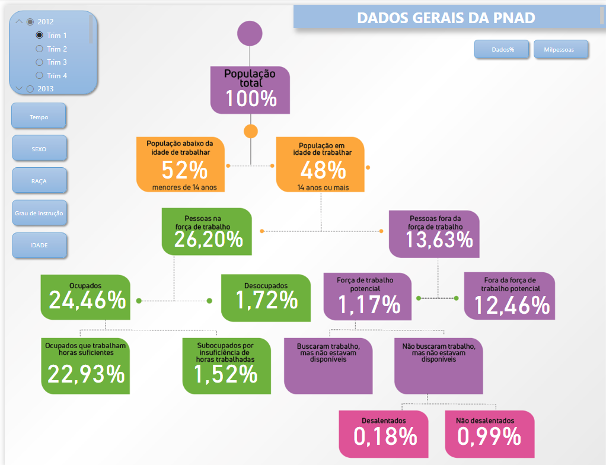

<h1 align="center"> Painel automatizado PNAD </h1>

Sistema automatizado de extração e transformação de dados envolvendo a parte do trabalho de MT  

  <a href="#-tecnologias">Tecnologias</a>&nbsp;&nbsp;&nbsp;|&nbsp;&nbsp;&nbsp;
  <a href="#-projeto">Projeto</a>&nbsp;&nbsp;&nbsp;

 

  

## 🚀 Tecnologias

Esse projeto foi desenvolvido com as seguintes tecnologias:

- Python
- PowerBI
- Git e Github
- PostgreSQL
- Requests, Pandas, Openpyxl

## 💻 Projeto

O processo consistia em realizar:

Extract, Transform, Loading dos dados da Pesquisa Nacional por Amostra de Domicílios  

Deixar todo o processo manual de maneira automatização desda extração até na atualização do painel de dados

Construir o dashboard para apresentação para partes interessadas

Desenvolvido em conjunto com Vinicius Hideki

